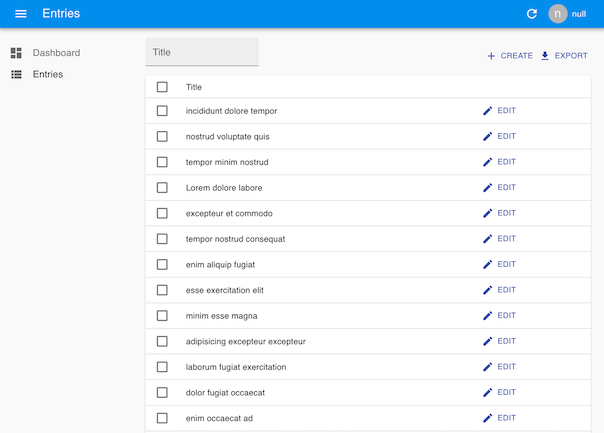
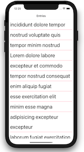

# Template project for React Admin and React Native app with Firebase data

This combines a [ReactAdmin](https://marmelab.com/react-admin/) site and [React Native](https://reactnative.dev/) app, with data from [Firebase Firestore](https://firebase.google.com/docs/firestore). [React-admin-firebase](https://github.com/benwinding/react-admin-firebase) is used to connect the admin site to Firebase. [Expo](https://expo.io/) is used for the React Native stuff for convenience.




## Requirements

XCode and Android Studio are needed for simulators. To use your own real device instead, install the Expo Go app on your device.

[Yarn](https://yarnpkg.com/) is required for code dependencies. 

Install the Expo command line tool for the React Native app. 
(Kathrin, when installing this, ignore the message that says to do audit fix.)
```
npm install --global expo-cli
```


## Firebase

Make a Firebase project, add a Firestore database. 

Set the Firestore rules to only allow authenticated write and read. 
```
rules_version = '2';
service cloud.firestore {
  match /databases/{database}/documents {
    match /{document=**} {
      allow read, write: if request.auth != null;
    }
  }
}
```

Add an authentication method in Firebase > Authentication > Get Started. The admin code in this project uses email signin method and no registration. 

Add yourself as a user in Firebase > Authentication > Users.

Copy the web config data from the Firebase project settings. These will be copied into the admin and client code.


## Data 

This project assumes that the data is a collection of docs with `title` and `info` (optional) fields. If you want to provide an ID for each entry, include the ID as the `first_key` value. If you don't include this key, Firebase will auto generate an ID. See the `data/sample.json` file for dummy data. Here's a snippet with just one doc:

```
{
    "entry": [
        {
            "first_key": "605750a83c1065c082efec0a",
            "title": "incididunt dolore tempor",
            "info": "this field is optional"
        }
    ]
}
```

If using a [JSON generator](https://next.json-generator.com/EyTd3VxV9) to build dummy data, the exported data may be a JSON array. Edit the exported data file and wrap the data array with the "entry" name and enclose it in an object `{}` as per the example above.

Make a data file locally with seed data and import it to Firestore using [firestore-export-import](https://www.npmjs.com/package/firestore-export-import). 

To use your own data schema, remember to change the admin site and app code!


## Code

Clone this repo.
```
git clone git@github.com:benfoley/react-admin-app-template.git
cd react-admin-app-template
```


## Client app

Copy the Firebase web config details into `client/index.tsx`.

Install dependencies and run the client app in iOS simulator. Ignore "unmet peer dependency" warnings.
```
cd client
yarn install
expo start
```

Now you should see a list of your data's entry titles in the emulator app.


## Admin site

Copy the firebase config into `src/App.tsx`

Install dependencies and run the admin site. Ignore "unmet peer dependency" warnings.
```
cd ../admin
yarn install
yarn start
```
The admin site should open in a browser at `http://localhost:3000/`.

Sign in, and you should see the Dashboard. Click the "Entries" menu item in the left sidebar to administer content.


## TODO

- When logged in, the user account widget in the top right shows `null` because the account doesn't have a display name. Should fix this.

- The app authenticates to Firestore as an anonymous user. Probably should include tokens or something to prevent anyone getting access using the API keys published here! 

